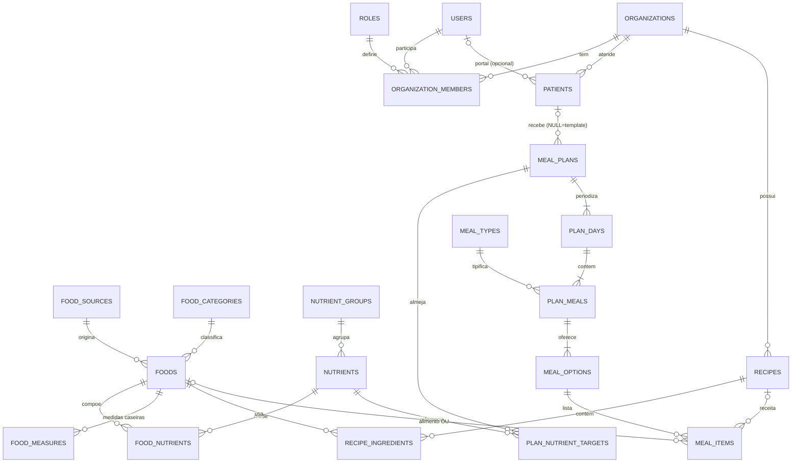

# Documento de Arquitetura e Engenharia — Plataforma de Gestão Nutricional

> **Documento aprovado (Revisão 2)** — constituição do projeto, referenciada pelo `AGENTS.md` na raiz.
> Referência funcional: paridade com o Webdiet (prontuário, anamnese, antropometria, planos alimentares com opções e periodização, diário alimentar, chat, agenda, financeiro do consultório, documentos com marca, app do paciente).

## 1. Contexto e objetivo

Construir um web app de gestão nutricional para profissionais de saúde, com o núcleo em **cadastro de alimentos** e **montagem de planos alimentares**, sob três regras absolutas: (1) fundação definitiva, sem débito técnico planejado; (2) tudo que é catálogo vem do banco, nada chumbado; (3) cálculos nutricionais em tempo real sem gargalo no front e com validação autoritativa no back.

## 2. Decisões definidas (confirmadas pelo dono do produto)

| #   | Decisão            | Definição                                                                                                                                                                                                                                                                                                                                    |
| --- | ------------------ | -------------------------------------------------------------------------------------------------------------------------------------------------------------------------------------------------------------------------------------------------------------------------------------------------------------------------------------------- |
| D1  | Modelo do produto  | **SaaS multiprofissional multi-tenant** (várias clínicas/nutris, cada uma vê só seus dados). **Sem billing/assinatura por ora** — nenhuma integração de cobrança da plataforma. O financeiro **do consultório** (registrar pagamentos/recibos de pacientes, recurso do Webdiet) permanece no escopo; o que sai é a monetização do SaaS em si |
| D2  | Acesso do paciente | **Dentro do escopo e priorizado**: Portal do Paciente (PWA) é a Fase 5, logo após o builder de planos — o paciente vê o plano assim que ele existe                                                                                                                                                                                           |
| D3  | Infra              | **Banco: Supabase** (Postgres, região `sa-east-1` São Paulo) · **App: Google Cloud Run** (container Docker, região `southamerica-east1` São Paulo) — app e banco na mesma cidade, latência mínima e dados de saúde no Brasil (LGPD)                                                                                                          |

## 3. Princípios de engenharia (as regras absolutas viradas em prática)

Estes seis princípios são o contrato do projeto — todo código das fases obedece a eles:

1. **Regra Enum vs Catálogo** (anti-hardcode sem sobre-dinamização):
   - **Catálogo = tabela no banco, editável e semeada**: nutrientes e seus grupos, unidades de medida, categorias de alimento, tipos de refeição, fontes de dados, tipos de medida antropométrica, tipos de exame, métodos de cálculo, templates de anamnese e de documento, serviços.
   - **Enum = código + constraint no banco**: estados de workflow dos quais a lógica ramifica (status de plano `draft/active/archived`, status de consulta, status de pagamento, sexo biológico para fórmulas). Adicionar um valor novo exige comportamento novo em código — tabela aqui só adicionaria risco, não flexibilidade.
   - Catálogos têm `organization_id` **nullable**: `NULL` = registro do sistema (seed, protegido por `is_system`); preenchido = customização da clínica. Cada clínica enxerga a união (sistema + próprios).

2. **Motor de cálculo único e isomórfico**: toda a matemática nutricional (conversão de medidas → gramas, escala de nutrientes, agregação item → opção → refeição → dia → plano, fórmulas de gasto energético, protocolos antropométricos) vive em `src/domain/` como **funções puras TypeScript, sem dependência de framework ou banco**. O mesmo módulo roda no navegador (feedback instantâneo) e no servidor (validação autoritativa). Divergência cliente/servidor = bug, nunca ambiguidade.

3. **Regra do Snapshot clínico**: resultado clínico gravado não muda retroativamente. Avaliações antropométricas, cálculos de gasto energético, anamneses respondidas e documentos gerados armazenam **entradas + método + resultado** no momento do registro. Planos alimentares gravam `resolved_grams` por item e, ao serem ativados/exportados, persistem um snapshot nutricional (`jsonb`) — editar um alimento depois não reescreve o histórico do paciente.

4. **Tenancy por construção**: toda tabela de dados da clínica tem `organization_id NOT NULL`. Repositórios recebem um `TenantContext` (orgId, userId, role) injetado pelo middleware da API e **todo** filtro o inclui — não existe caminho de query que ignore o tenant. Testes de integração verificam isolamento entre orgs.

5. **Política de precisão numérica**: banco usa `NUMERIC(12,4)` para nutrientes e `INTEGER` (centavos) para dinheiro. Em runtime, float64 com arredondamento centralizado em um único helper do domínio (tolerância nutricional é 0,1 g — o erro acumulado de float64 fica ordens de grandeza abaixo disso; biblioteca decimal só adicionaria latência no hot path do builder).

6. **Rastreabilidade e LGPD**: soft delete (`deleted_at`) em dados clínicos, `created_by/updated_by` em tudo, trilha em `audit_logs`, consentimento registrado no paciente, dados hospedados no Brasil. Strings de UI centralizadas em arquivos de mensagem pt-BR (i18n futura vira tarefa mecânica, não reescrita).

## 4. Stack tecnológica

TypeScript estrito de ponta a ponta — um só idioma, tipos compartilhados entre schema do banco, API e UI. Uma aplicação Next.js (monólito modular) empacotada em **um container**, com fronteiras internas policiadas por lint — não um monorepo de microsserviços, que seria overhead puro para este time e escala.

| Camada                | Escolha                                             | Por quê                                                                                                                                                                                               |
| --------------------- | --------------------------------------------------- | ----------------------------------------------------------------------------------------------------------------------------------------------------------------------------------------------------- |
| Framework             | **Next.js 15+ (App Router) + React 19**             | Full-stack em um deployable; RSC para páginas de leitura, client components para o builder; maior ecossistema React                                                                                   |
| UI                    | **Tailwind CSS v4 + shadcn/ui**                     | Componentes acessíveis e possuídos no repo (sem lock-in de lib de UI), velocidade de construção                                                                                                       |
| API interna           | **tRPC v11 + TanStack Query**                       | Type-safety ponta a ponta sem contrato REST manual — mudou o schema, o front quebra em compile-time, não em produção. Se um dia houver app nativo/API pública, expõe-se REST sobre os mesmos services |
| Estado do builder     | **Zustand** (+ seletores memoizados)                | Store leve, subscrição granular por componente — chave da performance da tela de dieta (§7.2)                                                                                                         |
| Formulários/validação | **React Hook Form + Zod**                           | Os mesmos schemas Zod validam no front e no servidor — validação nunca diverge                                                                                                                        |
| ORM                   | **Prisma 6**                                        | Migrations declarativas versionadas (a disciplina que sustenta "zero refactor"), Prisma Studio, maturidade                                                                                            |
| Banco                 | **PostgreSQL 16 (Supabase, sa-east-1)**             | Relacional é o formato natural deste domínio; `unaccent` + `pg_trgm` para busca de alimentos; região São Paulo (LGPD)                                                                                 |
| Auth                  | **Supabase Auth**                                   | E-mail/senha, Google, reset, MFA prontos e battle-tested; espelho em `public.users` via trigger; funciona em qualquer host Node (Cloud Run incluso) via `@supabase/ssr`                               |
| Storage               | **Supabase Storage**                                | Fotos de pacientes, anexos, PDFs — mesma conta, mesmas policies                                                                                                                                       |
| Hospedagem do app     | **Google Cloud Run** (Docker, `southamerica-east1`) | Runtime Node completo no container (chromium p/ PDF, `sharp`), autoscaling com scale-to-zero em staging e `min-instances=1` em produção (sem cold start no builder), rollback instantâneo por revisão |
| Jobs/rotinas          | **Cloud Scheduler + Cloud Tasks**                   | Nativos do GCP, sem vendor extra: Scheduler para lembretes/rotinas (chamando endpoints internos autenticados via OIDC), Tasks para trabalho assíncrono pesado                                         |
| Segredos              | **GCP Secret Manager**                              | Nenhum segredo em repo ou imagem; injetados no Cloud Run                                                                                                                                              |
| E-mail                | **Resend + react-email**                            | Transacionais (convite de paciente, reset, lembrete de consulta)                                                                                                                                      |
| Drag & drop / listas  | **dnd-kit + TanStack Virtual**                      | Reordenação no builder; virtualização da busca de alimentos                                                                                                                                           |
| Gráficos              | **Recharts**                                        | Evolução de peso/composição corporal                                                                                                                                                                  |
| Testes                | **Vitest + Testing Library + Playwright**           | Unit no motor de cálculo (golden tests), integração na API, e2e nos fluxos críticos                                                                                                                   |
| CI/CD                 | **GitHub Actions → Artifact Registry → Cloud Run**  | typecheck + lint + testes + build em todo PR; imagem única promovida de staging a produção; autenticação keyless via Workload Identity Federation                                                     |
| Observabilidade       | **Sentry + logs estruturados (pino)**               | Erros com contexto de tenant desde o dia 1; logs caem no Cloud Logging                                                                                                                                |

## 5. Modelagem do banco de dados

### 5.1 Convenções globais

- PK `uuid` (v7 — ordenável, índices saudáveis); `created_at/updated_at` em tudo; `created_by/updated_by` onde há autoria; `deleted_at` (soft delete) em dados clínicos; `sort_order` onde o usuário ordena; nomes de coluna `snake_case`.
- `organization_id NOT NULL` em dados da clínica; **nullable apenas em catálogos** (NULL = sistema).
- Texto de busca: coluna normalizada (sem acento, minúscula) + índice GIN trigram.

### 5.2 Domínios e tabelas

**A) Identidade e Tenancy**

| Tabela                 | Campos-chave                                                                                                                                            | Relações/observações                                                                                                                          |
| ---------------------- | ------------------------------------------------------------------------------------------------------------------------------------------------------- | --------------------------------------------------------------------------------------------------------------------------------------------- |
| `organizations`        | name, slug, logo_url, settings `jsonb`                                                                                                                  | O tenant (clínica/consultório). Branding para PDFs vive aqui                                                                                  |
| `users`                | auth_id (Supabase), name, email, phone, avatar_url                                                                                                      | Espelho de `auth.users`; um humano, global                                                                                                    |
| `roles`                | key, name, permissions `jsonb`, is_system                                                                                                               | Seed: `owner`, `nutritionist`, `secretary`, `patient`. Catálogo — perfis novos sem deploy                                                     |
| `organization_members` | organization_id, user_id, role_id, status                                                                                                               | N:N usuário↔clínica com papel. Um nutri pode atuar em duas clínicas                                                                           |
| `patients`             | organization_id, assigned_to (user), user_id **nullable**, name, birth_date, sex (enum, p/ fórmulas), gender_identity, contatos, consent_at, deleted_at | **Paciente é prontuário, não login**: `user_id` só é preenchido quando ele ganha acesso ao portal. Decisão que destrava a Fase 5 sem migração |

**B) Catálogos globais (o coração do anti-hardcode)**

| Tabela                | Campos-chave                                                                        | Observações                                                                                                                                                                                                                          |
| --------------------- | ----------------------------------------------------------------------------------- | ------------------------------------------------------------------------------------------------------------------------------------------------------------------------------------------------------------------------------------ |
| `nutrient_groups`     | name, sort_order                                                                    | "Macronutrientes", "Vitaminas", "Minerais"…                                                                                                                                                                                          |
| `nutrients`           | key, name, unit (g/mg/µg/kcal), nutrient_group_id, decimals, is_core, sort_order    | **Nutrientes são linhas, não colunas** — TACO tem ~30, USDA 100+; suportar qualquer fonte sem ALTER TABLE. `is_core` marca os exibidos no resumo do builder (kcal, PTN, CHO, LIP)                                                    |
| `measurement_units`   | name, abbreviation, type (enum mass/volume/unit), grams_per_unit                    | "grama", "ml", "unidade", "fatia" — conversão para a base                                                                                                                                                                            |
| `food_categories`     | organization_id?, name, icon, color, sort_order                                     | Cereais, carnes, laticínios…                                                                                                                                                                                                         |
| `food_sources`        | key, name, version, license_note                                                    | TACO, TBCA, IBGE, USDA, CUSTOM — proveniência de cada alimento                                                                                                                                                                       |
| `meal_types`          | organization_id?, name, icon, default_time, sort_order                              | Café da manhã, almoço… clínica cria os seus                                                                                                                                                                                          |
| `calculation_methods` | key, kind (enum energy/body_composition), name, params `jsonb`, sex/age constraints | Harris-Benedict, Mifflin, FAO/OMS, Katch-McArdle, Cunningham, Tinsley; Pollock 3/7, Durnin, Petroski… A **matemática** fica em código (Strategy por `key`, testável); o **catálogo do que existe e seus coeficientes** fica no banco |
| `measurement_types`   | key, name, unit, group (dobra/circunferência/bioimpedância/básica), sort_order      | Dobra tricipital, circunf. cintura…                                                                                                                                                                                                  |
| `exam_types`          | organization_id?, name, unit, reference_range `jsonb`                               | Glicemia, colesterol…                                                                                                                                                                                                                |

**C) Alimentos e receitas**

| Tabela                                     | Campos-chave                                                                                                                                                                 | Observações                                                                                                                                                      |
| ------------------------------------------ | ---------------------------------------------------------------------------------------------------------------------------------------------------------------------------- | ---------------------------------------------------------------------------------------------------------------------------------------------------------------- |
| `foods`                                    | organization_id? (NULL = sistema), food_source_id, food_category_id, name, name_normalized, base_qty (100), base_unit (g/ml), kcal/protein_g/carb_g/fat_g (cache), is_active | Cache de macros **denormalizado deliberadamente** para listagem/busca rápidas; fonte da verdade é `food_nutrients` (importador e CRUD mantêm ambos em transação) |
| `food_nutrients`                           | food_id, nutrient_id, amount `NUMERIC(12,4)`                                                                                                                                 | Valor por 100 g/ml. UNIQUE(food_id, nutrient_id)                                                                                                                 |
| `food_measures`                            | food_id, name ("colher de sopa cheia"), gram_weight                                                                                                                          | Medidas caseiras (IBGE) — essencial na UX do builder                                                                                                             |
| `recipes`                                  | organization_id, name, yield_qty, servings, instructions, photo_url                                                                                                          | Preparações da clínica; nutrição = agregação dos ingredientes via motor de cálculo                                                                               |
| `recipe_ingredients`                       | recipe_id, food_id, qty, food_measure_id?, resolved_grams                                                                                                                    |                                                                                                                                                                  |
| `equivalence_groups` / `equivalence_items` | organization_id?, name / group_id, food_id, qty, gram_weight                                                                                                                 | Listas de substituição ("troque X por Y") — Fase 7                                                                                                               |

**D) Planos alimentares (o núcleo)**

Hierarquia de 5 níveis que reproduz o Webdiet real — periodização por dia e opções substituíveis por refeição:

| Tabela                  | Campos-chave                                                                                                                                                               | Observações                                                                                                                                                                                     |
| ----------------------- | -------------------------------------------------------------------------------------------------------------------------------------------------------------------------- | ----------------------------------------------------------------------------------------------------------------------------------------------------------------------------------------------- |
| `meal_plans`            | organization_id, patient_id **nullable**, created_by, name, status (enum draft/active/archived), is_template, start/end_date, notes, nutritional_snapshot `jsonb`, version | `patient_id NULL + is_template` = **template reutilizável — mesma estrutura, zero duplicação de modelo**. Snapshot preenchido na ativação (princípio 3). `version` p/ lock otimista do autosave |
| `plan_nutrient_targets` | meal_plan_id, nutrient_id, target_min, target_max                                                                                                                          | Metas **por nutriente como dados** — meta de fibra ou de sódio sem mudar schema                                                                                                                 |
| `plan_days`             | meal_plan_id, name ("Padrão", "Dia de treino"), weekdays `int[]`, sort_order                                                                                               | Todo plano tem ≥1 dia; periodização semanal = vários dias                                                                                                                                       |
| `plan_meals`            | plan_day_id, meal_type_id, custom_name?, scheduled_time, sort_order, notes                                                                                                 |                                                                                                                                                                                                 |
| `meal_options`          | plan_meal_id, name ("Opção 1"), sort_order                                                                                                                                 | Opções substituíveis; toda refeição tem ≥1                                                                                                                                                      |
| `meal_items`            | meal_option_id, food_id?, recipe_id? (**CHECK: exatamente um**), qty, measurement_unit_id?, food_measure_id?, resolved_grams, sort_order, notes                            | `resolved_grams` calculado pelo motor e persistido: agregações e histórico nunca dependem de reconversão                                                                                        |

**E) Clínico** (Fase 6) — sempre com snapshot:

- `assessments` (patient, date, body_composition_method_id, notes) + `assessment_values` (assessment, measurement_type, value) + `assessment_results` (resultados calculados congelados: %G, massa magra, IMC…).
- `energy_calculations` (patient, date, calculation_method_id, inputs `jsonb`, activity_factor, result_kcal, adjustment).
- `anamnesis_templates` + `anamnesis_questions` (type enum text/number/select/multi/bool/scale, options `jsonb`, required, sort) + `anamnesis_responses` (respostas com cópia do texto da pergunta — template editado não reescreve anamnese antiga).
- `patient_exams` + `exam_results` (exam_type, value, collected_at).

**F) Portal do paciente** (Fase 5) e **operação da clínica** (Fases 7–8):

- `food_diary_entries` (patient, datetime, meal_type_id?, description, photo_url) e `messages` (org, patient, sender, body, read_at) — diário alimentar e chat do portal.
- `appointments` (org, patient, professional, start/end, status enum, service_id, notes), `services` (org, name, duration, price_cents).
- `document_templates` (org?, type, body richtext com merge-fields) + `documents` (patient, conteúdo gerado, pdf_path) — orientações, receituários, atestados.
- `payments` (org, patient, appointment_id?, amount_cents, method, status enum, paid_at) — financeiro **do consultório** (sem billing de plataforma).
- `attachments` (polimórfico controlado: owner_type + owner_id, storage_path), `audit_logs` (org, user, action, entity, entity_id, diff `jsonb`).

### 5.3 Diagrama ER do núcleo



### 5.4 Busca e índices críticos

- `foods`: GIN trigram em `name_normalized` (+ extensão `unaccent`) — type-ahead instantâneo sobre TACO+TBCA (~5–8 mil linhas) + alimentos da clínica; índice parcial `WHERE deleted_at IS NULL`.
- Compostos de tenancy: `(organization_id, name)` em patients, `(organization_id, status)` em meal_plans e appointments; FKs todas indexadas.
- `food_nutrients`: PK composta `(food_id, nutrient_id)` — leitura do plano faz um único fetch dos nutrientes de todos os alimentos envolvidos.

## 6. Arquitetura do Backend

**Estilo: monólito modular com camadas (Clean Architecture pragmática)** dentro do Next.js. Quatro camadas, dependências apontando só para dentro, fronteiras policiadas por `eslint-plugin-boundaries` (import ilegal = erro de CI, não convenção de boa vontade):

```
src/
├── domain/                  # ← NÚCLEO PURO: zero import de framework/banco
│   ├── nutrition/           # resolveGrams, scaleNutrients, aggregate, planTotals
│   ├── energy/              # fórmulas GET (Strategy por calculation_methods.key)
│   ├── anthropometry/       # protocolos de dobras, Siri/Brozek, IMC
│   └── shared/              # round(), tipos de valores, schemas Zod das entidades
├── server/
│   ├── services/            # casos de uso: orquestram repositórios + domain; fronteira de transação
│   ├── repositories/        # todo acesso Prisma; TODO filtro inclui TenantContext
│   ├── auth/                # sessão Supabase → TenantContext (orgId, userId, role)
│   └── trpc/                # routers finos: parse (Zod) → authorize → service → resposta
├── app/                     # rotas Next.js (RSC + client components)
├── components/              # UI compartilhada (shadcn + próprios)
└── lib/                     # infra transversal (logger, email, storage, jobs)
```

Padrões e regras:

- **Domain isolado e isomórfico** (princípio 2): é o pacote importável pelo cliente. `server/` jamais é importado pelo front.
- **Repository**: única camada que toca o Prisma. Recebe `TenantContext` por parâmetro — impossível esquecer o filtro de org.
- **Service = caso de uso** (`createMealPlan`, `applyPlanChanges`, `importFoodTable`): valida invariantes de negócio, abre a transação, chama o domain para números autoritativos.
- **Strategy registrada por catálogo**: fórmulas de GET e protocolos antropométricos são funções puras registradas num mapa `key → fn`; o banco (`calculation_methods`) diz o que existe e com quais coeficientes/limites, o código diz como calcular. Novo método = 1 função + 1 seed + testes.
- **Autorização em duas camadas**: middleware tRPC resolve sessão → membership → role; policies por recurso (`canManagePatient(ctx, patient)`) decididas no service, nunca na UI. No portal, a policy do paciente restringe tudo ao próprio `patient_id`.
- **Validação**: todo input passa por Zod no router (os mesmos schemas do front). O servidor **recalcula** totais com o motor — nunca confia em número vindo do cliente.
- **Concorrência do autosave**: lock otimista por `version` no `meal_plans`; conflito → 409 → cliente recarrega e reaplica patches locais.

## 7. Arquitetura do Frontend

### 7.1 Organização das rotas

- **RSC (server components)** para tudo que é leitura: dashboard, listas de pacientes/alimentos/planos, prontuário — dados frescos, zero JS de estado.
- **Client islands** para as ferramentas interativas: o builder de dieta, calculadoras, formulários dinâmicos de anamnese.
- Grupos de rota: `(auth)` login/cadastro · `(app)` shell da clínica (sidebar, seletor de org) · `(portal)` paciente (Fase 5, PWA mobile-first) · `(admin)` catálogos do sistema.

### 7.2 O Builder de Dieta (a tela crítica) — estratégia de estado

O problema: centenas de itens editáveis, totais de ~30 nutrientes recalculados a cada tecla, em 4 níveis de agregação, sem travar a UI.

1. **Carga única, estado normalizado**: uma query tRPC traz o grafo do plano; o store Zustand guarda entidades **normalizadas por id** (`days`, `meals`, `options`, `items` como `Record<id, T>` + arrays de ordenação) e um cache `foodId → nutrientes/100g` dos alimentos referenciados. Editar um item é um write de O(1) — nada de árvore aninhada re-clonada.
2. **Totais são derivados, nunca armazenados**: seletores memoizados **por refeição** — digitar a quantidade de um item recalcula só a refeição dele; o total do dia/plano deriva dos totais de refeição já memoizados. Componentes assinam fatias granulares: a linha editada, o cabeçalho da sua refeição e a barra de resumo re-renderizam; o resto do plano, não.
3. **Custo com folga comprovada**: pior caso realista (7 dias × 6 refeições × 3 opções × 10 itens ≈ 1.260 itens × 30 nutrientes ≈ 40 mil multiplica-somas) roda em « 1 ms em JS. Com memoização por refeição, a edição típica custa microssegundos. **Não há necessidade de Web Worker — decisão baseada em aritmética, não em otimismo.**
4. **Autosave com outbox**: cada mutação local vira um patch numa fila; flush com debounce de ~800 ms via `plan.applyChanges` (batch, transacional), UI otimista. O servidor valida com Zod, recalcula com o **mesmo motor** e devolve `version` + totais autoritativos; divergência → toast + reconciliação (na prática, alarme de bug).
5. **Busca de alimento inline**: TanStack Query + debounce contra o endpoint trigram; resultados virtualizados; selecionar alimento já traz medidas caseiras e nutrientes para o cache local (cálculo instantâneo, sem novo round-trip).
6. **Comparação com metas ao vivo**: barra fixa compara totais derivados vs `plan_nutrient_targets` (verde/amarelo/vermelho por nutriente).
7. dnd-kit para reordenar itens/refeições (persiste `sort_order` no mesmo fluxo de patches).

### 7.3 Demais telas

React Hook Form + Zod em todos os formulários; Recharts na evolução do paciente. **PDF do plano** (Fase 7): o Cloud Run roda chromium (Playwright) dentro do container sem as limitações de serverless — PDF server-side de alta fidelidade com a marca da clínica, com rota de impressão CSS como fallback imediato. Portal do paciente = PWA responsiva no mesmo app, rotas `(portal)`, instalável no celular.

## 8. Segurança e LGPD

- Dados de saúde no Brasil (Supabase `sa-east-1`, Cloud Run `southamerica-east1`), TLS em tudo, criptografia at-rest dos provedores.
- Isolamento de tenant na camada de repositório + testes de isolamento; RLS do Postgres como segunda muralha (fase de hardening). No portal, paciente só acessa o próprio prontuário (policy testada).
- `audit_logs` em mutações clínicas; soft delete; consentimento (`consent_at`) e exportação de dados do paciente (direito de portabilidade) na Fase 8.
- Segredos exclusivamente no GCP Secret Manager; rate limiting nas rotas de auth/busca na fase de hardening; backups: PITR do Supabase + dump agendado (Cloud Scheduler) com ensaio de restore.

## 9. Qualidade contínua (o que garante o "zero débito")

- **Motor de cálculo**: Vitest com **golden tests** contra valores publicados (TACO/literatura das fórmulas) — a corretude nutricional é verificável, não estimada.
- **API**: testes de integração por service com banco efêmero (isolamento de tenant incluso).
- **E2E (Playwright)**: fluxos vitais — login, cadastrar alimento, montar plano e conferir totais na tela contra o motor.
- **CI em todo PR**: typecheck estrito + ESLint (com regras de fronteira) + testes + build da imagem Docker. Migration nova só via `prisma migrate` versionado. Merge na main → deploy automático em staging (Cloud Run); produção por promoção manual da mesma imagem.
- **Critério de pronto de toda fase**: sem `TODO`/`any`/console.log, testes verdes, deploy de staging funcional.

## 10. Roadmap de execução (fases de código)

Cada fase termina **deployável e testada**; nenhuma fase depende de algo que a anterior não entregou. Portal do paciente priorizado (D2) logo após o builder — a cadeia de valor é direta: alimentos → planos → paciente vê o plano.

| Fase  | Nome                            | Entrega                                                                                                                                                                                                                                                                                                                                                                   | Aceite (verificação)                                                                                                            |
| ----- | ------------------------------- | ------------------------------------------------------------------------------------------------------------------------------------------------------------------------------------------------------------------------------------------------------------------------------------------------------------------------------------------------------------------------- | ------------------------------------------------------------------------------------------------------------------------------- |
| **0** | Fundação                        | **AGENTS.md na raiz**; repo + Next.js + TS estrito, ESLint/Prettier/boundaries; Prisma + Supabase conectados; tRPC wireado; **Dockerfile (standalone) + Cloud Run** (staging/prod) + GitHub Actions completo; Sentry; **auth** (login/cadastro/reset, espelho `users`); **organizations/members/roles** com seed; middleware de TenantContext; shell da UI (sidebar/tema) | Staging no Cloud Run no ar; e2e de login/criar clínica verde; CI vermelho bloqueia merge; rollback por revisão testado          |
| **1** | Catálogos + Motor               | Todas as tabelas de catálogo (B) com CRUD admin e **seeds pt-BR completos**; `src/domain` v1: conversões, escala, agregação, fórmulas de GET e protocolos antropométricos                                                                                                                                                                                                 | Golden tests do motor 100% verdes contra valores publicados                                                                     |
| **2** | Banco de Alimentos              | `foods/food_nutrients/food_measures`; **importadores idempotentes TACO + TBCA** (+ medidas caseiras IBGE); busca trigram; CRUD de alimentos próprios; receitas com nutrição agregada                                                                                                                                                                                      | Buscar "arroz" responde <150 ms; macros de 10 alimentos conferem com a tabela oficial; importador re-executável sem duplicar    |
| **3** | Pacientes                       | CRUD + prontuário (shell com abas), consentimento LGPD, anexos, listagem com busca                                                                                                                                                                                                                                                                                        | e2e cadastro→prontuário; isolamento entre orgs testado                                                                          |
| **4** | **Builder de Planos** (coração) | Hierarquia D completa; builder com busca inline, medidas caseiras, opções por refeição, dias/periodização, drag & drop, **totais em tempo real**, metas por nutriente com semáforo, templates + clonagem, autosave otimista, snapshot na ativação                                                                                                                         | e2e do fluxo completo; totais da UI = totais do servidor (mesmo motor); editar 1 item não re-renderiza o resto (React Profiler) |
| **5** | **Portal do Paciente (PWA)**    | Convite por e-mail (Resend) e acesso do paciente (`patients.user_id`), ver plano ativo (com opções e medidas caseiras), diário alimentar com foto (Supabase Storage), lista de compras derivada do plano, chat básico (Supabase Realtime), evolução                                                                                                                       | Paciente vê só o que é dele (testes de policy); PWA instalável no celular; diário com foto funcional                            |
| **6** | Ferramentas Clínicas            | Antropometria (protocolos + gráficos de evolução), calculadora de GET (métodos + fator atividade → vira meta do plano), anamnese dinâmica (templates/questões/respostas), exames laboratoriais                                                                                                                                                                            | Resultados clínicos conferem com o motor; snapshots imutáveis testados                                                          |
| **7** | Entregáveis + Agenda            | PDF do plano com marca da clínica (chromium no container), documentos com templates e merge-fields, listas de substituição, agenda de consultas + lembrete por e-mail (Cloud Scheduler), serviços                                                                                                                                                                         | PDF fiel ao plano ativo; lembrete disparado em staging                                                                          |
| **8** | Financeiro + Produção           | Financeiro do consultório (pagamentos/recibos — **sem billing de plataforma**), dashboard, relatórios, auditoria visível, exportação LGPD, rate limiting, RLS, backups verificados                                                                                                                                                                                        | Checklist de produção completo; restore de backup ensaiado                                                                      |

**Núcleo de valor = Fases 0–5** (alimentos + planos + paciente vendo o plano no celular). A partir da 6, cada fase é um incremento independente já sustentado pela fundação.

## 11. Riscos e trade-offs assumidos

1. **"Primeira versão é a final"** — o que se garante não é ausência de mudança (o domínio vai ensinar coisas novas), e sim que mudanças serão **aditivas e baratas**: camadas isoladas, catálogos em dados, migrations versionadas e testes que seguram o comportamento. É assim que "zero débito" existe no mundo real.
2. **Paridade total com o Webdiet é um produto de anos** — o roadmap ordena por valor clínico; fases 0–5 já entregam o diferencial central. Body3D (composição corporal por foto) é ML proprietário: fora de escopo, os protocolos de dobras cobrem a necessidade.
3. **Anti-hardcode tem limite deliberado** — a Regra Enum vs Catálogo (§3.1) impede o erro simétrico: dinamizar lógica de workflow em banco cria um "motor de regras" indepurável. Flexibilidade onde há variação real; código onde há comportamento.
4. **Cache denormalizado de macros em `foods`** — redundância deliberada e encapsulada (mantida em transação) para busca/listagem instantâneas; fonte da verdade continua `food_nutrients`.
5. **Cloud Run exige um pouco mais de setup inicial que um PaaS de frontend** (Dockerfile, Actions, Secret Manager) — pago uma vez na Fase 0 e ganho para sempre: runtime completo (PDF via chromium), portabilidade total do container e custo previsível.
6. **Integrações externas (Google Calendar, WhatsApp)** ficam para depois da Fase 8 — dependem de aprovações/custos de API de terceiros; e-mail cobre lembretes até lá.

## 12. Time de Agentes

O time de agentes (Maestro, Átlas, Newton, Forja, Pixel, Sentinela e Timoneiro), suas missões, escopos e instruções estão definidos em [`AGENTS.md`](../AGENTS.md) na raiz do projeto — fonte única da verdade sobre o regimento do time. Em conflito com este documento, este documento vence.

## 13. Fontes da pesquisa funcional

[Funcionalidades principais do Webdiet](https://blog.webdiet.com.br/2026/05/05/software-para-nutricionistas-webdiet-principais-funcionalidades/) · [Como o Webdiet funciona](https://blog.webdiet.com.br/2026/05/29/entenda-o-webdiet-como-funciona/) · [Ferramentas fundamentais](https://blog.webdiet.com.br/2025/05/27/ferramentas-webdiet-fundamentais/) · [Gestão do consultório](https://blog.webdiet.com.br/2026/05/12/funcionalidades-webdiet-gestao-do-consultorio-nutricional/) · [Site oficial](https://webdiet.com.br/site/)
